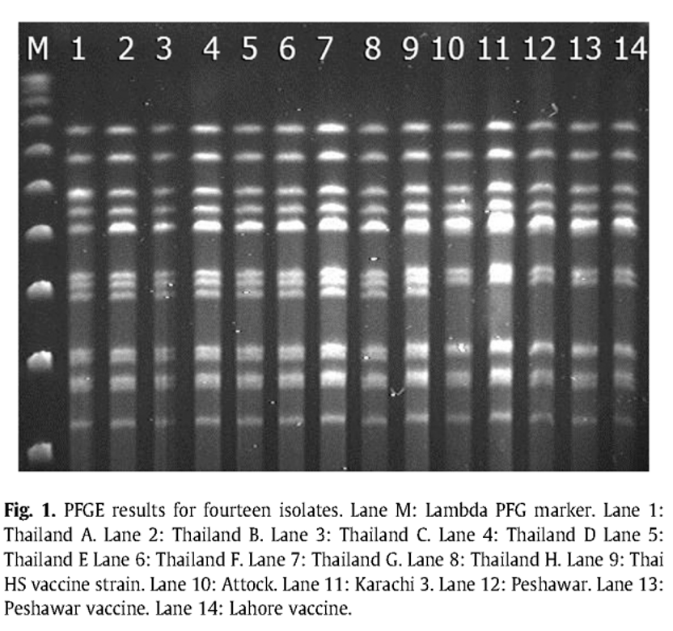
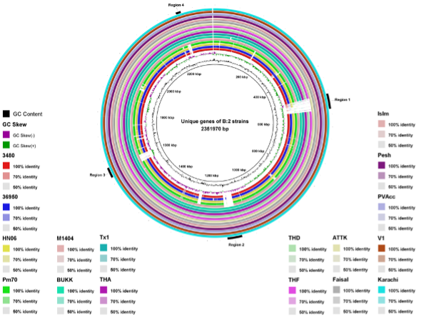
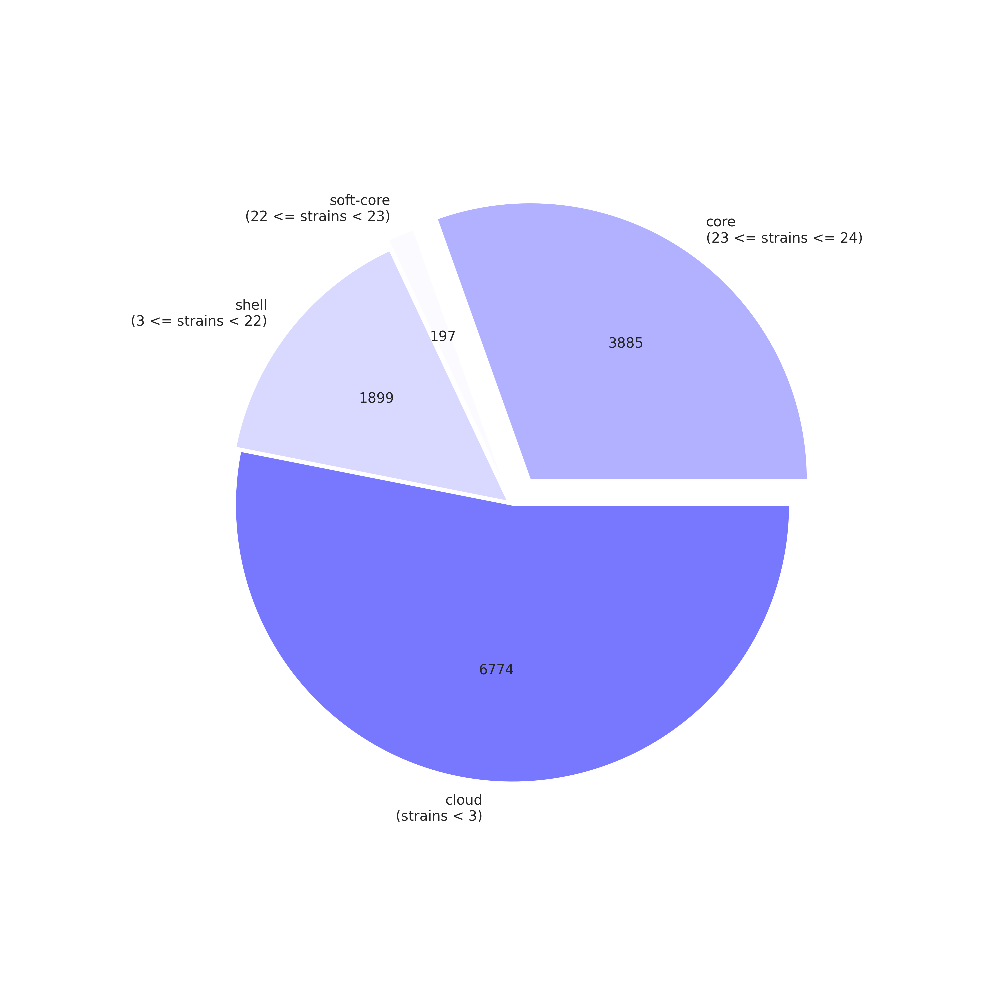
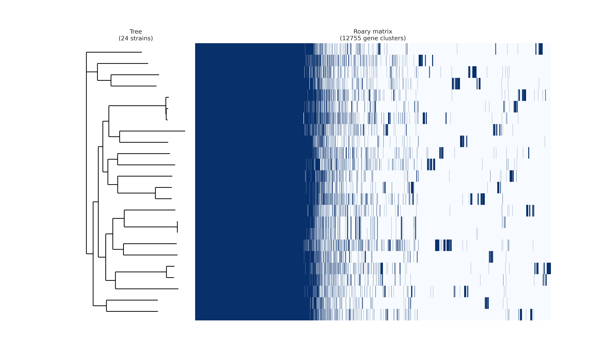

# Strain Diversity, Pangenomes, and Graph-based Analysis with Panaroo
## PennCHOP Microbiome Symposium – Strain Tracking in the Microbiome
### Table of Contents
<br/>
1. Why Strain Diversity Matters

2. MLST: The Classical View of Strain Diversity

3. What Is a Pangenome?

4. E. coli as a Flagship Pangenome Example

5. Why Pangenomes Are Essential for Strain Tracking

6. Panaroo: A Modern, Graph-Based Pangenome Tool

7. Accessory Genome GWAS (Scoary / pyseer)

8. Summary

<br/>

1. **Why Strain Diversity Matters**

Microbial “species” consist of thousands of genetically distinct strains, each with unique combinations of genes that determine:

* metabolic pathways

* colonization potential

* virulence

* environmental persistence

* antimicrobial resistance (AMR)

* epidemiological behavior

* Two isolates labeled “E. coli” can differ by >2,000 genes, multiple plasmids, or entire virulence islands.

* Strain-level diversity—not species-level—is what drives clinical, ecological, and microbiome-relevant phenotypes.


2. **MLST: The Classical View of Strain Diversity**

Multi-Locus Sequence Typing (MLST) assigns strains to Sequence Types (STs) by analyzing SNPs in 7 conserved housekeeping genes.<br/>

**Strengths**

* reproducible standard

* global comparability

* captures population structure

**Limitations**

* examines only ~5 kb of the genome

* ignores plasmids, genomic islands, and mobile elements

* strains within the same ST may differ by hyndreds of accessory genes

MLST captures mutation-driven changes, but bacteria evolve primarily through horizontal gene transfer—requiring pangenome analysis.<br/>

Example STs:

* E. coli ST131

* K. pneumoniae ST307

* S. aureus ST8

* P. multocida ST122
**Even isolates belonging to the same ST may differ by significant accessory genes, plasmids, prophages, and islands.**<br/>


<br/>



3. **What Is a Pangenome?**

The pangenome of a species is the full collection of genes found across all its strains.<br/>

It is typically much larger than the genome of any single member of the species. The pangenome can be divided into two categories: the core genome and the accessory genome.<br/>

The core genome is the set of genes that are present in all members of the species. These genes are essential for the basic functions and survival of the microorganisms and are typically conserved due to their importance.<br/>

The accessory genome (also known as the dispensable or flexible genome) is the set of genes that are present in some, but not all, members of the species. It is typically more variable than the core genome. These genes can provide additional capabilities or adaptations to specific environments, such as:

**Accessory genes determine:**

* AMR profiles

* virulence traits

* metabolic capabilities

* niche specialization

* environmental survival

* outbreak behavior


In some cases, more categories are included:<br/>

Shell genes: These genes are present in a moderate number of strains within a species, making them more frequent than cloud genes but less conserved than core genes.<br/>

Cloud genes: These genes are present in only a few strains within a species and are the least conserved genes in the pangenome. Cloud genes can represent recent acquisitions of genetic material, such as through horizontal gene transfer.<br/>

Summary:
* Core genome: Shared by all strains (essential functions)
* Shell genes: Present in a subset of strains
* Cloud genes: Rare; often plasmid-, phage-, or island-associated
* Accessory genome: Shell + cloud genes; major functional diversity


The pangenome can be used to study the evolution of microbial species, to identify genes that are important for particular functions, and to develop new methods for microbial diagnostics and therapeutics.<br/>


4. **_E. coli_ as a Flagship Pangenome Example**

* Touchon et al., 2009 — PLoS Genetics

	* Analyzed 20 genomes

	* ~2,200 core genes

	* 18,000 total pangenome genes


5. **Why Pangenomes Are Essential for Strain Tracking**

* Accessory genome variation reveals:

* outbreak transmission

* environmental or maternal reservoirs

* AMR plasmid spread

* virulence and colonization traits

* host specificity

* microevolution during colonization

**Ignoring accessory genes misses most biologically meaningful differences between strains.**


6. **Panaroo: A Modern, Graph-Based Pangenome Tool**

[Panaroo](https://gtonkinhill.github.io/panaroo/#/)
Tonkin-Hill et al., Genome Biology (2020)

Panaroo corrects annotation errors and produces a more accurate pangenome using gene neighborhood graphs.

6.1 **Simple command**
```
panaroo -i gff/*.gff
```
6.2 **Panaroo Outputs**

* [gene_presence_absence.csv](gene_presence_absence.csv)

* Alignment for downstream phylogenetics

6.3 **Carbon utilization in 24 _K. pneumoniae_**

* Analyzed 24 genomes

* 3,885 core genes

* 12,755 total pangenome genes






7. **Accessory Genome GWAS (Scoary)**

After Panaroo generates a presence/absence matrix:

* [Scoary](https://github.com/AdmiralenOla/Scoary) is simple and fast GWAS tool that outputs enriched genes, p-values, and odds ratios<br/>

Example [traits](scoary_traits_file.csv):

* AMR vs susceptible

* maternal vs infant

* NICU outbreak vs sporadic

* gut vs environmental isolates

* persistent vs transient colonizers

```
scoary -g gene_presence_absence.csv -t traits.csv
```


**Accessory genome GWAS highlights genes associated with clinically relevant phenotypes.**

[Scoary Results](Scoary_results.csv)  


8. **Summary**

* Strain-level diversity is fundamental to microbiome and clinical biology.

* MLST provides population structure but misses gene-content variation.

* _E. coli_ illustrates the enormous scale of bacterial pangenomes.

* Panaroo’s graph-based error correction provides the most accurate pangenome.

* Here are some examples of how the pangenome has been used in research:

	* To study the evolution of microbial species: The pangenome can be used to compare the genomes of different strains of a species
	* To identify genes that have been gained or lost over time. This can help to understand how the species has adapted to different environments.
	* To identify genes that are important for particular functions:
	* To develop new methods for microbial diagnostics and therapeutics: The pangenome can be used to identify genes that are unique to particular strains of a species. This can help to develop new methods for diagnosing and treating microbial infections.

## Further Readings
* [Scoary](https://genomebiology.biomedcentral.com/articles/10.1186/s13059-016-1108-8)
* [Panaroo](https://genomebiology.biomedcentral.com/articles/10.1186/s13059-020-02090-4)

## Teaching Evaluations
Please evaluate my teaching!<br/>
To start the survey, you may use either of the two choices (the Survey Access Code or
the QR code), whichever you find easiest or quickest to use.
1. Please access this [Survey title: "Teaching Evaluations" link](https://redcap.chop.edu/surveys/). Then enter this code: WAE4YWJYK.
2. Teaching Evaluation QR Code


Please complete the survey below as follows.
* Division of Faculty Member (GI/Nutrition/Hepatology)
* Faculty Member (Ahmed M Moustafa)
* Type of teaching (Lectures/Discussions etc.)
* Date of Teaching (12-03-2025)
* Topic of Lecture (PCMP Workshop)
* Your Position (put your position)
* Quality of this instructor (choose a value)
* Comments (optional but will be appreciated)
